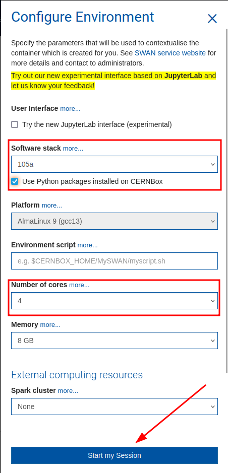
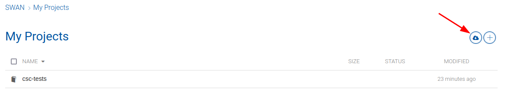
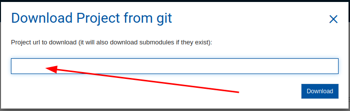
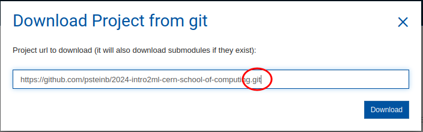
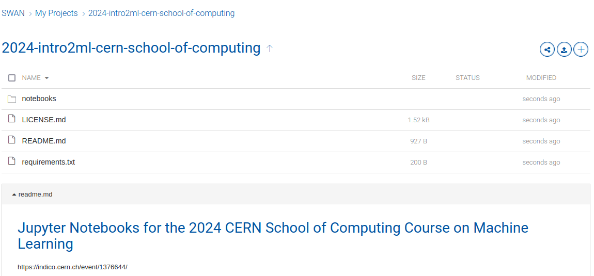

# Jupyter Notebooks for the 2024 CERN School of Computing Course on Machine Learning

https://indico.cern.ch/event/1376644/

## installation instructions for local execution

Some dependencies are rather hard to install for this workflow. The `requirements.txt` was tested with python `3.9` to `3.12`. 

0. clone this repo: `git clone https://github.com/psteinb/2024-intro2ml-cern-school-of-computing csc24-ml`
1. change into the repo root folder: `cd csc24-ml`
2. create a `venv` by `python -m venv py311 --upgrade-deps` (e.g. for python `3.11`)
3. setup that `venv` by doing `source py311/bin/activate`
4. (optional) install `uv` for faster installations (see [uv docs](https://github.com/astral-sh/uv))
5. either do `uv pip install -r ./requirements.txt` or plain `python -m pip install -r ./requirements.txt`

If you like to train cpu-only, you can install torch without CUDA support. This is best beformed between step 2 and 4 in the recipe above by running:
```shell
uv pip install --extra-index-url https://download.pytorch.org/whl/cpu torch
```
or without `uv`:
```shell
python -m pip install --extra-index-url https://download.pytorch.org/whl/cpu torch
```

## Usage on SWAN

If you want to use the CERN SWAN system, here is a brief intro on how to do it:

0. open https://swan.cern.ch (provide your credentials if required)
1. you should be queried for the software environment to setup (if not use `...` in the top menue and click `Change configuration`)  
<div style="display: block;margin-left: auto;margin-right: auto;width: 75%;"></div>  
Make the changes as highlighted below:  
<div style="display: block;margin-left: auto;margin-right: auto;width: 75%;"></div>
2. Under `My Projects`, click on `Download Project from git` (right hand side)  
<div style="display: block;margin-left: auto;margin-right: auto;width: 75%;"></div>  
You should see this now:  
<div style="display: block;margin-left: auto;margin-right: auto;width: 75%;"></div>  
3. insert the URL to this repo `https://github.com/psteinb/2024-intro2ml-cern-school-of-computing.git` (including a trailing `.git` suffix as indicated)  
<div style="display: block;margin-left: auto;margin-right: auto;width: 75%;"></div>  
4. Hit `Download`! 
5. You should see something like this   
<div style="display: block;margin-left: auto;margin-right: auto;width: 75%;"></div>  
6. Please open `notebooks/00_intro2ml_envcheck.ipynb`. Read and run all cells!

## Check your Software Stack

This repo has a small utility prepared which can check if you software environment is ready. Either run:
``` bash
python notebooks/00_intro2ml_envcheck.py
```
or open the paired notebook `notebooks/00_intro2ml_envcheck.ipynb` and execute all cells.
